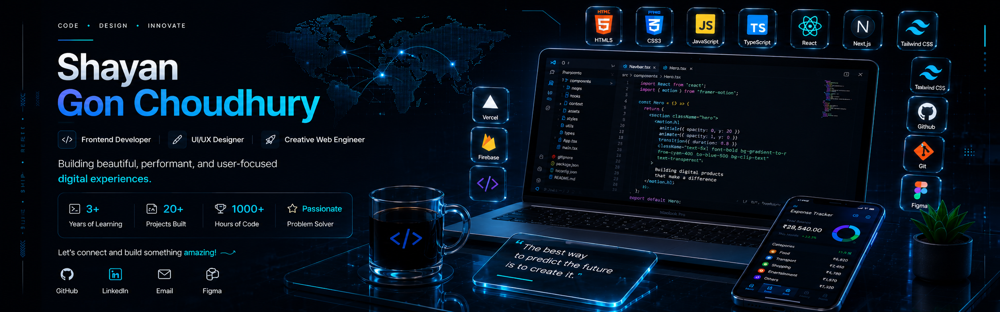

<!-- ===================================================== -->
<!--               PREMIUM GITHUB PROFILE                  -->
<!-- ===================================================== -->

<!-- Replace banner.png with your custom banner later -->

<p align="center">

</p>

<h1 align="center">
Hi 👋 I'm Shayan Gon Choudhury
</h1>

<h3 align="center">
Frontend Developer • UI/UX Enthusiast • Computer Science Student
</h3>

<p align="center">
Building modern, responsive and user-focused web applications.
</p>

<p align="center">


</p>

---

# 💫 About Me

```javascript
const shayan = {

    education: "B.Tech Computer Science Engineering",

    role: "Frontend Developer",

    location: "India",

    interests: [

        "Frontend Development",

        "UI/UX Design",

        "Artificial Intelligence",

        "Modern Web Technologies"

    ],

    currentlyLearning: [

        "React",

        "Next.js",

        "TypeScript",

        "Node.js"

    ],

    goal: "Build software that creates meaningful user experiences.",

    funFact: "I enjoy turning creative ideas into interactive web experiences."

}
```

---

# 🚀 Current Focus

🌱 Learning **React, Next.js & TypeScript**

🎨 Improving **UI/UX Design Skills**

💻 Building **Real World Web Applications**

🤝 Looking for **Software Development Internship Opportunities**

📚 Exploring **AI Powered Applications**

---

# 🛠 Tech Stack

### Languages

<p align="center">


</p>

### Frameworks

<p align="center">


</p>

### Tools

<p align="center">


</p>

---

# 🌟 Featured Projects

| Project | Description |
|---------|-------------|
| 💰 Expense Tracker | Smart expense tracking web application with modern UI |
| 🎓 Aura Academic | Academic website with responsive design |
| 🌐 Portfolio Website | Personal portfolio showcasing projects and skills |
| 📅 Neo-Class Scheduler | Futuristic class timetable and attendance manager |

---

# 📈 GitHub Analytics

<p align="center">


</p>

---

# 🔥 GitHub Streak

<p align="center">


</p>

---

# 📊 Contribution Graph

<p align="center">


</p>

---

# 🏆 GitHub Trophies

<p align="center">


</p>

---

# 🎯 2026 Goals

- ✅ Master Advanced JavaScript
- 🔄 Build 15+ Production Ready Projects
- 🔄 Learn React & Next.js
- 🔄 Learn TypeScript
- 🔄 Learn Backend Development
- 🔄 Contribute to Open Source
- 🔄 Secure a Software Development Internship

---

# 📚 Currently Learning

- React.js

- Next.js

- TypeScript

- Node.js

- UI/UX Design

- REST APIs

- Performance Optimization

---

# 📈 Development Philosophy

> Clean code is not just about making software work—it's about creating experiences that are maintainable, intuitive, and enjoyable for both users and developers.

---

# 📫 Connect With Me

<p align="center">

<a href="https://github.com/shayangonchoudhury-svg">

</a>

<a href="https://linkedin.com/in/YOUR-LINKEDIN">

</a>

<a href="mailto:shayangonchoudhuryskms@gmail.com">

</a>

</p>

---

# 👀 Visitors

<p align="center">


</p>

---

# 💭 Quote

> **"Every great product starts with curiosity, grows through consistency, and succeeds by solving real problems."**

---

<p align="center">

⭐ If you like my work, consider following my journey and checking out my projects!

</p>
