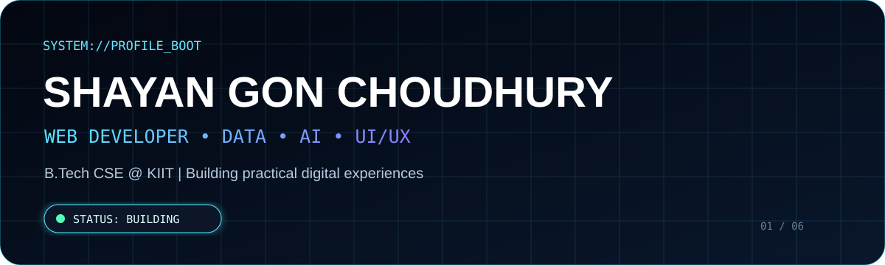
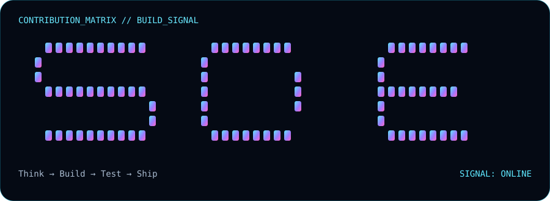
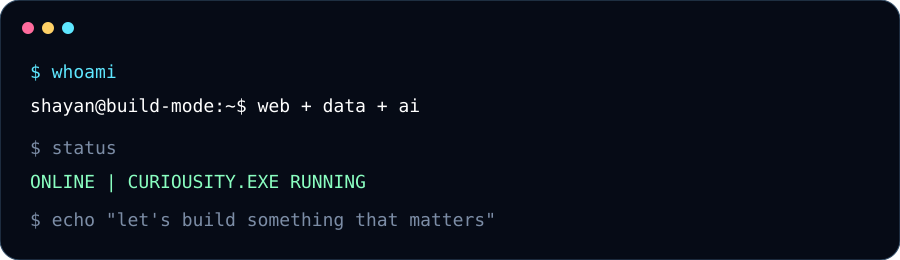
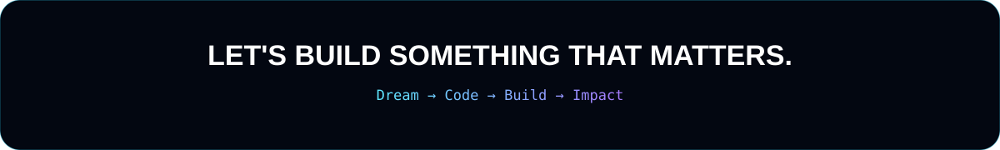

<div align="center">



<br/>

<a href="https://github.com/shayangonchoudhury-svg">
  
</a>
<a href="https://www.linkedin.com/">
  
</a>

</div>

---

## `01 / PROFILE`

<table>
<tr>
<td width="34%" align="center">


</td>
<td width="66%">

### `SHAYAN GON CHOUDHURY`

**B.Tech CSE @ KIIT** · **Web Developer** · **Data & AI**

I build practical digital experiences at the intersection of **web development, data science, AI, and UI/UX**.

```text
STATUS       →  ONLINE / BUILDING
FOCUS        →  WEB + DATA + AI
PHILOSOPHY   →  PRACTICAL • USEFUL • IMPACTFUL
MODE         →  LEARN → BUILD → SHIP
```

</td>
</tr>
</table>

## `02 / EXPERIENCE`

| Role | Organization |
|---|---|
| 📊 Data Science Intern | **ISI Kolkata** |
| 🌐 Web Development Intern | **Pinnacle Labs** |
| 🛰️ Former Intern | **BSNL** |
| 🎓 B.Tech CSE | **KIIT University** |

## `03 / TECH STACK`

<p align="center">
  
</p>

## `04 / FEATURED BUILDS`

<table>
<tr>
<td width="50%">

### 🚆 RailOpt AI
**Railway Block Planning Simulation**

Constraint-aware planning and scheduling concept focused on practical decision support.

`Python` `AI/ML` `FastAPI` `React`

</td>
<td width="50%">

### 🎨 Design Collaboration Portal
Collaborative web platform concept focused on teamwork, cloud synchronization and a polished interface.

`React` `Firebase` `Tailwind`

</td>
</tr>
<tr>
<td>

### 📊 Data Projects
Data analysis and visualization workflows designed to turn datasets into understandable insights.

`Python` `Pandas` `Visualization`

</td>
<td>

### ⚡ Web Experiments
Frontend experiments, utilities and interactive web interfaces built while exploring new ideas.

`HTML` `CSS` `JavaScript`

</td>
</tr>
</table>

## `05 / GITHUB SIGNAL`

<div align="center">


<br/>


</div>

## `06 / CONTRIBUTION MATRIX`

<div align="center">



<br/><br/>


</div>

## `07 / CURRENTLY BUILDING`

```text
┌──────────────────────────────────────────────────────────────┐
│  WEB DEVELOPMENT       ████████████████████░░  ACTIVE        │
│  DATA SCIENCE          █████████████████░░░░░  EXPLORING     │
│  MACHINE LEARNING      ███████████████░░░░░░  EXPLORING     │
│  AI / LLMs             █████████████░░░░░░░░  LEARNING      │
│  SYSTEM DESIGN         ████████████░░░░░░░░░  LEARNING      │
└──────────────────────────────────────────────────────────────┘
```

## `08 / TERMINAL`

<div align="center">

</div>

## `09 / CONNECT`

<div align="center">

<a href="https://github.com/shayangonchoudhury-svg">
  
</a>
<a href="https://www.linkedin.com/">
  
</a>

<br/><br/>



</div>

<!--
PROFILE README NOTES
1. Create/use the repository named exactly: shayangonchoudhury-svg
2. Put README.md and the assets/ folder in its root.
3. Replace the LinkedIn URL above with your actual profile.
4. Replace/add project links once you want individual project cards.
5. The external stats widgets are intentionally live; they update from GitHub activity.
-->
