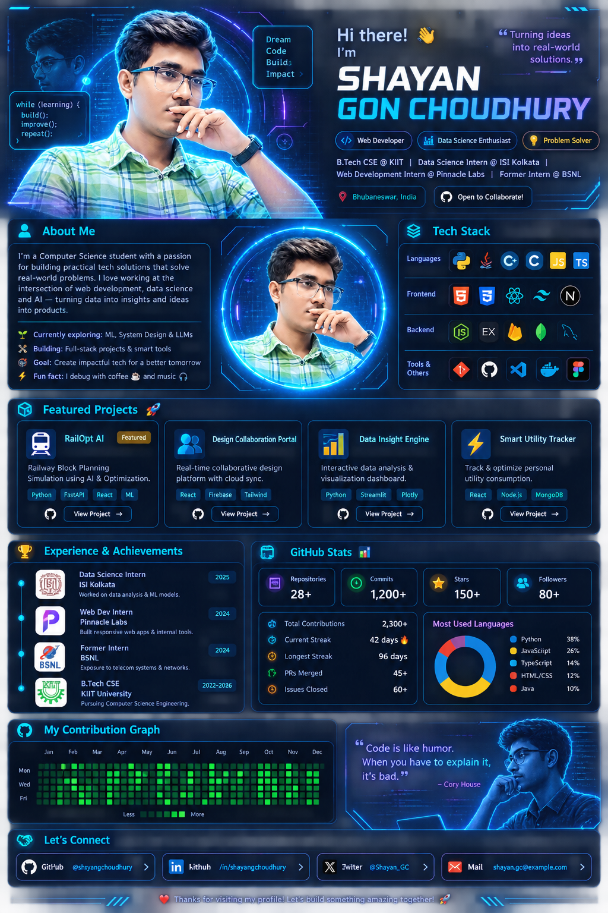

<div align="center">

# ⚡ SHAYAN GON CHOUDHURY

### `Web Developer` · `Data Science Enthusiast` · `Problem Solver`



<br/>


<br/>

<a href="https://github.com/">
  
</a>
<a href="https://www.linkedin.com/">
  
</a>
<a href="mailto:your.email@example.com">
  
</a>

</div>

---

## 🧬 SYSTEM PROFILE

```text
┌──────────────────────────────────────────────────────────────┐
│  USER                SHAYAN GON CHOUDHURY                   │
│  ROLE                WEB DEVELOPER                          │
│  EDUCATION           B.Tech CSE @ KIIT                      │
│  CURRENT FOCUS       Web Development + Data Science + AI   │
│  BUILD PHILOSOPHY    Practical • Useful • Impactful        │
│  STATUS              ONLINE / BUILDING                     │
└──────────────────────────────────────────────────────────────┘
```

> **Dream → Code → Build → Impact.**

I'm a Computer Science student who enjoys turning ideas into practical technology. I work across web development and data-driven projects, while continuously exploring AI, machine learning, system design, and modern developer tools.

### 🎯 Current Mission

- 🔭 Building practical, real-world software projects
- 🌐 Developing modern full-stack web experiences
- 📊 Exploring data science and machine learning
- 🤖 Learning how AI can become useful products
- 🧠 Strengthening problem-solving and system-design skills
- 🤝 Looking for interesting projects and collaborations

---

## ⚙️ TECH STACK

### Languages

<p>

</p>

### Frontend & Backend

<p>

</p>

### Data, AI & Tools

<p>

</p>

---

## 🚀 FEATURED BUILDS

<table>
<tr>
<td width="50%">

### 🚆 RailOpt AI
**Railway Block Planning Simulation**

A constraint-aware railway planning simulation focused on optimization, scheduling logic, and decision support.

**Stack:** `Python` `AI/ML` `FastAPI` `React`

</td>
<td width="50%">

### 🎨 Design Collaboration Portal
A collaborative design platform concept focused on real-time teamwork, cloud synchronization, and a polished modern interface.

**Stack:** `React` `Firebase` `Tailwind`

</td>
</tr>

<tr>
<td width="50%">

### 📊 Data Insight Engine
Interactive data analysis and visualization workflows designed to turn datasets into understandable insights.

**Stack:** `Python` `Data Science` `Visualization`

</td>
<td width="50%">

### ⚡ Smart Utility Tracker
A web application concept for tracking consumption patterns and turning everyday data into actionable insights.

**Stack:** `React` `Node.js` `MongoDB`

</td>
</tr>
</table>

> 💡 Replace the project names and links above with your actual repository URLs when you are ready.

---

## 💼 EXPERIENCE

| Role | Organization |
|---|---|
| 📊 Data Science Intern | **ISI Kolkata** |
| 🌐 Web Development Intern | **Pinnacle Labs** |
| 🛰️ Former Intern | **BSNL** |
| 🎓 B.Tech CSE | **KIIT University** |

---

## 📈 GITHUB ACTIVITY

<div align="center">

<!-- Replace YOUR_GITHUB_USERNAME with your actual GitHub username -->


<br/>


</div>

---

## 🐍 CONTRIBUTION MATRIX

<div align="center">

<!-- Optional: enable the contribution snake workflow in your repository -->


</div>

---

## 🧠 CURRENTLY LEARNING

```text
Web Development      ███████████████████░░  90%
Data Science         ████████████████░░░░░  78%
Machine Learning     ██████████████░░░░░░░  70%
AI / LLMs            ████████████░░░░░░░░░  60%
System Design        ███████████░░░░░░░░░░  55%
```

---

## 🏆 BUILD PRINCIPLES

<table>
<tr>
<td align="center">💡<br/><b>Think</b><br/>Understand the problem.</td>
<td align="center">⚙️<br/><b>Build</b><br/>Turn ideas into systems.</td>
<td align="center">🧪<br/><b>Test</b><br/>Learn through iteration.</td>
<td align="center">🚀<br/><b>Ship</b><br/>Create real impact.</td>
</tr>
</table>

---

## 🌌 BEYOND THE CODE

```text
> Curiosity.exe        RUNNING
> Learning.exe         RUNNING
> Building.exe         RUNNING
> Coffee.exe           REQUIRED
> Giving_up.exe        NOT_FOUND
```

> *"The best way to predict the future is to build it."*

---

## 🌐 CONNECT

<div align="center">

<a href="https://github.com/YOUR_GITHUB_USERNAME">
  
</a>
<a href="https://www.linkedin.com/in/YOUR_LINKEDIN_USERNAME/">
  
</a>
<a href="mailto:your.email@example.com">
  
</a>

<br/><br/>

### ⚡ `Let's build something that matters.`


</div>
